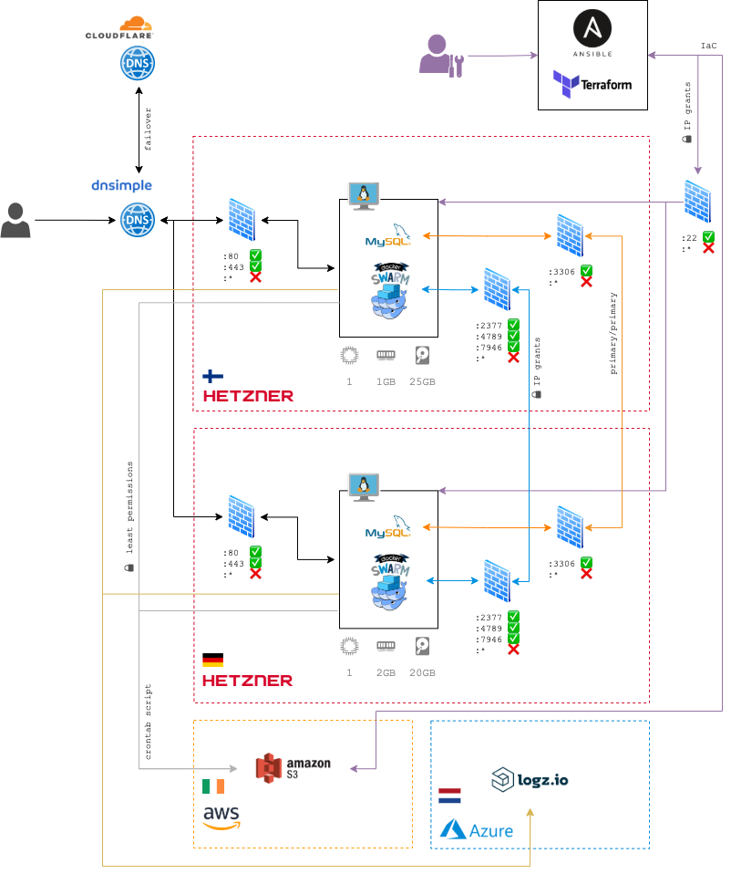

# DISASTER RECOVERY PLAN

## Failures/Threats

 - Application
   - Social Engineering Attack
   - Pervasive Malware Attack
   - Stolen Confidential Information (digital and documents)
   - Loss of Key Digital Files and/or Databases
 - Network
   - Malicious Intruder
   - Denial of Service Attack
 - Data Center
   - Fire
   - Flood and water damage
   - Bomb Threat
   - Server Failure
 - Citywide
   - Earthquake
   - Hurricane
   - Terrorist Attack
 - Regional
 - National
 - Multinational

---

## Inventory

### Users

All access is granted only to Fabio.

### Providers

 - Hetzner (Cloud)
   - Regions:
     - [Helsinki - Finland](https://docs.hetzner.com/general/others/data-centers-and-connection/#tuusulahelsinki) (`web-1`)
     - [Nuremberg - Germany](https://docs.hetzner.com/general/others/data-centers-and-connection/#nuremberg) (`web-2`)
 - Scaleway (Cloud)
   - Regions:
     - [Paris - France](https://documentation.online.net/en/dedicated-server/overview/datacenters) (`web-3`)
 - AWS (Storage)
   - Regions:
     - [Ireland](https://aws.amazon.com/about-aws/global-infrastructure/regions_az/) (`eu-west-1`)
 - CloudFlare (DNS)

### Topology



### Stack

#### VMs

 - `web-1`: 1 vCPU, 1GB RAM, 25GB HDD
 - `web-2`: 1 vCPU, 1GB RAM, 25GB HDD
 - `web-3`: 1 vCPU, 1GB RAM, 10GB HDD

#### Software

 - Ubuntu 20.04.2 LTS
 - Ansible 2.10.7
 - Terraform 0.14.8
 - Docker Swarm 20.10.6
 - MySQL 8.0

---

## Metrics

### RPO (Recovery Point Object)

 - DB RPO: 1 hour
 - Storage RPO: 24 hours

### RTO (Recovery Time Object)

 - DB RTO: 1 hour
 - Storage RTO: 24 hours

---

## Backups - Database

### Retention

 - 24 hourly backups
 - 7 daily backups
 - 4 weekly backups
 - 3 monthly backups

### Locations

 - hourly backups, folder name: `hourly`
 - daily backups, folder name: `daily`
 - weekly backups, folder name: `weekly`
 - monthly backups, folder name: `monthly`

| Location | Path |
|---|---|
| Local | `web-2:/var/backups/` |
| Online | `s3://xxx-db-backup` (region: `eu-west-1`) |
| Offline | `EXT-HDD(Seagate) /path/to/backups` |

### Security

All backups are encrypted.
There are 2 files:
 - encryption key: `key.enc` 
 - dump: `alldb.sql.gz.enc`

The encryption key is encrypted with the backup priv/pub key.  
The private key is located only at `EXT-HDD(Seagate) /path/to/backup.key`.
The public key is located at:
 - `EXT-HDD(Seagate) /path/to/backup.pub`
 - `web-2:/root/.ssh/backup.pub`

How to decrypt the MySQL backup:

```shell
openssl rsautl -decrypt -inkey backup.pem -in key.enc -out key.bin
openssl enc -d -aes-256-cbc -in alldb.sql.gz.enc -out alldb.sql.gz -pass file:./key.bin
```

**Note:** There is no un-encrypted backup available. No breakglass solution is available in this regards.

## Backups - Storage

### Retention

 - indefinite

### Locations

| Location | Path |
|---|---|
| Local | `web-1:/var/www/` <br /> `web-2:/var/www/`  <br /> `web-3:/var/www/` |
| Online | `s3://xxx-storage` (region: `eu-west-1`) |
| Offline | `EXT-HDD(Seagate) /path/to/backups` |

### Security

All backups are not encrypted.

---

## Scenarios


### The encryption key is lost/corrupted

 - If the DB nodes are not all down, do a fresh backup dump from one of nodes available (`web-1` or `web-2`).
 - If the DB nodes are all down, try to take it out of the cluster and reboot it, then take the backup dump.
 - If the DB nodes are all down and won't start again try to follow [this guide](https://severalnines.com/database-blog/my-mysql-database-corrupted-what-do-i-do-now).

### The backup key is lost/corrupted

 - If the DB nodes are not all down, do a fresh backup dump from one of nodes available (`web-1` or `web-2`).
 - If the DB nodes are all down, try to take it out of the cluster and reboot it, then take the backup dump.
 - If the DB nodes are all down and won't start again try to follow [this guide](https://severalnines.com/database-blog/my-mysql-database-corrupted-what-do-i-do-now).

### The encryption key has been compromised

 - If no DB backups has been leaked, there shouldn't be any problem: all the previous backups need to be destroyed and need to generate a new backup key:
    ```shell
    openssl genrsa -out backup.key 4096
    openssl rsa -in backup.key -outform PEM -pubout -out backup.pem
    ```
 - If a DB has leaked (along with the encryption key) you might need to report it within 72 hours to the [ICO](https://ico.org.uk/for-organisations/guide-to-data-protection/guide-to-the-general-data-protection-regulation-gdpr/personal-data-breaches/).

### The datacenter is down for good

It is possible to create a new cluster (db, storage, swarm/k8s) somewhere else (check the commands in the SETUP section).

### The DNS is down

It's needed to switch the authoritative nameservers in the registrar panel to point to a new service.

### The HDD failed

If the HDD of the node VM is broken/corrupted it is easier to launch a new VM using the IaC with Terraform.

### Disk space is running low/full

Run the command to free some extra space:

```shell
apt-get autoremove && apt-get autoclean
journalctl --rotate && journalctl --vacuum-time=1s
docker system prune
rm /var/log/*.?.gz # only really needed
```

### RAM is running low/full

Run the command to free some extra space:

```shell
free && sync && echo 2 > /proc/sys/vm/drop_caches && free # if running low
free && sync && echo 3 > /proc/sys/vm/drop_caches && free # if running full
```

### Got a ransomware

Delete the affected VM(s), create new ones using IaC and use the latest hourly database dump and the latest storage backup (from AWS S3).
