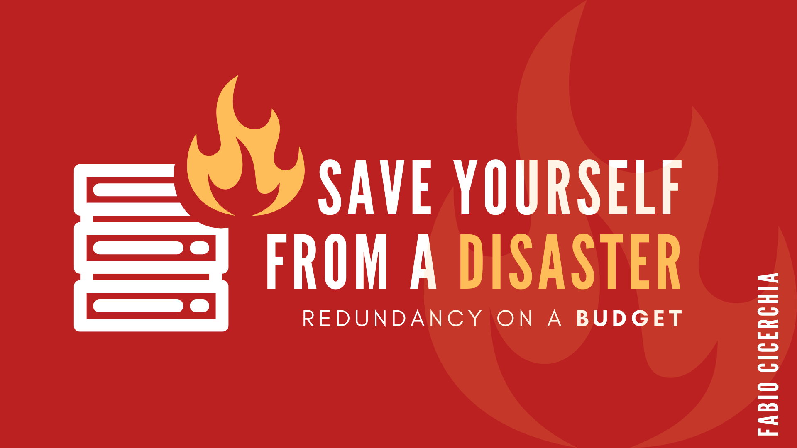

# README

This repository contains the whole code used in my infrastructure, it is complementary to the blog posts and/or the ebook I wrote.

 - [Ebook "Save Yourself From a Disaster - Redundancy On a Budget"](https://leanpub.com/savefromdisaster)
 - [Blog post series "Save yourself from a disaster: Redundancy on a budget"](https://devpath.pro/web/save-yourself-from-a-disaster-redundancy-on-a-budget/)

## Disclaimer

The code present in this repository need to be carefully reviewed and tested in your development/pre-production environment.  
I don't take any responsibility for any damage, interruption of service nor leak/loss of data for the use of the instructions in the ebook (nor from any external website I've mentioned).

## Details

 - [Setup](SETUP.md)
 - [Disaster Recovery Plan](DRP.md)

